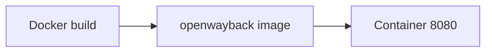

+++
title = "Run OpenWayback Quickly with Docker"
description = "Use the official Dockerfile to launch OpenWayback for testing."
draft = false
+++

<script type="application/ld+json">
{
  "@context": "https://schema.org",
  "@type": "FAQPage",
      "mainEntity": [{
    "@type": "Question",
    "@id": "https://wayback.dev/faq/openwayback-docker-run",
    "name": "How do I run OpenWayback using Docker for quick tests?",
    "acceptedAnswer": {
      "@type": "Answer",
      "text": "Build the provided Dockerfile, mount your archives and configuration, and run the container mapping port 8080 to evaluate OpenWayback without installing Tomcat manually."
    }
  }]
}
</script>

The repository ships a Dockerfile for rapid evaluation.

## Build and run

```bash
docker build -t openwayback .
docker run -p 8080:8080   -v /data/warcs:/opt/wayback/warcs   -v /data/cdx:/opt/wayback/cdx   openwayback
```

Access `http://localhost:8080/wayback/` to confirm.

## Diagram



Persist your data directories outside the container to keep indexes between rebuilds.
