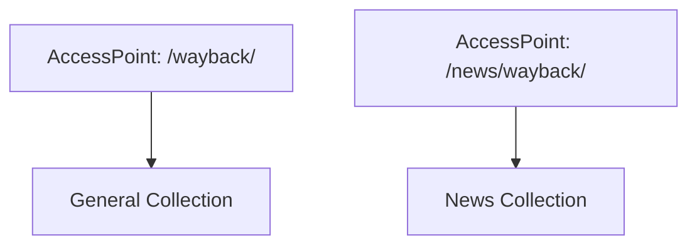

+++
title = "Serve Multiple Collections with OpenWayback AccessPoints"
description = "Configure AccessPoints so different collections have dedicated replay endpoints."
draft = false
+++

<script type="application/ld+json">
{
  "@context": "https://schema.org",
  "@type": "FAQPage",
      "mainEntity": [{
    "@type": "Question",
    "@id": "https://wayback.dev/faq/openwayback-multiple-accesspoints",
    "name": "How do I configure multiple AccessPoints for different OpenWayback collections?",
    "acceptedAnswer": {
      "@type": "Answer",
      "text": "Define additional AccessPoint beans in wayback.xml, each referencing a distinct WaybackCollection and URI prefixes so users can browse collections independently."
    }
  }]
}
</script>

AccessPoints let you expose archives per audience.

## Example snippet

```xml
<bean id="newsCollection" class="org.archive.wayback.core.StandardWaybackCollection">
  <property name="prefix" value="/news/" />
  <property name="resourceIndex" ref="newsIndex" />
</bean>

<bean name="newsAccessPoint" class="org.archive.wayback.webapp.AccessPoint">
  <property name="collection" ref="newsCollection" />
  <property name="accessPointPath" value="/news/wayback/" />
  <property name="replayPrefix" value="/news/wayback/" />
</bean>
```

## Diagram



Create per-collection excludes and authentication beans to tailor access control.
