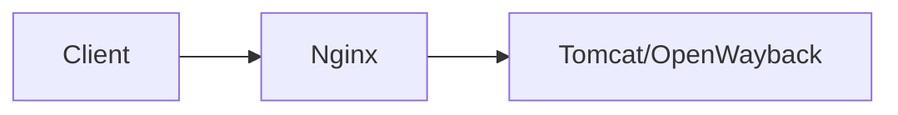

+++
title = "Deploy OpenWayback Behind a Reverse Proxy"
description = "Configure context paths and headers so OpenWayback works behind Nginx or Apache proxies."
draft = false
+++

<script type="application/ld+json">
{
  "@context": "https://schema.org",
  "@type": "FAQPage",
  "mainEntity": [{
    "@type": "Question",
      "@id": "https://wayback.dev/faq/openwayback-reverse-proxy",
    "name": "How do I run OpenWayback behind a reverse proxy like Nginx?",
    "acceptedAnswer": {
      "@type": "Answer",
      "text": "Set wayback.url.scheme, host, and context in wayback.xml, configure rewrites for /wayback/, and forward X-Forwarded-* headers so the toolbar generates correct links."
    }
  }]
}
</script>

Reverse proxies add TLS and caching in front of Tomcat.

## wayback.xml adjustments

```xml
wayback.url.scheme=https
wayback.url.host=archives.example.com
wayback.url.port=443
wayback.url.context=archives
wayback.url.prefix=${wayback.url.scheme}://${wayback.url.host}/${wayback.url.context}
```

## Nginx snippet

```nginx
location /archives/wayback/ {
  proxy_pass http://127.0.0.1:8080/wayback/;
  proxy_set_header Host $host;
  proxy_set_header X-Forwarded-Proto $scheme;
  proxy_set_header X-Forwarded-Port $server_port;
}
```

## Diagram



Restart Tomcat and Nginx, then verify replay URLs respect the proxy host.
