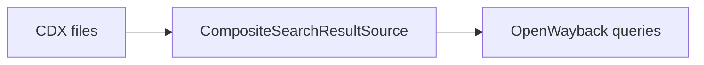

+++
title = "Switch OpenWayback to CDX Indexing"
description = "Replace Berkeley DB indexing with CDX-based lookups for OpenWayback."
draft = false
+++

<script type="application/ld+json">
{
  "@context": "https://schema.org",
  "@type": "FAQPage",
  "mainEntity": [{
    "@type": "Question",
      "@id": "https://wayback.dev/faq/openwayback-switch-to-cdx",
    "name": "How do I configure OpenWayback to use CDX indexes instead of Berkeley DB?",
    "acceptedAnswer": {
      "@type": "Answer",
      "text": "Disable the localbdbcollection bean, enable the CDXCollection with CompositeSearchResultSource, and point the resourceFileLocationDB to a path-index so OpenWayback reads sorted CDX files."
    }
  }]
}
</script>

CDX indexes scale better for large archives.

## Steps
1. Generate CDX files:
   ```bash
   bin/cdx-indexer archive.warc.gz cdx-index/index.cdx
   ```
2. Edit `WEB-INF/wayback.xml`:
   ```xml
   <!-- Disable BDB collection -->
   <!-- <ref bean="localbdbcollection" /> -->
   <ref bean="localcdxcollection" />
   ```
3. Configure `CDXCollection.xml` with `CompositeSearchResultSource` if you have multiple indexes.
4. Map ARC/WARC paths using `FlatFileResourceFileLocationDB`.

## Diagram



Restart Tomcat after changes and monitor logs for missing paths.
