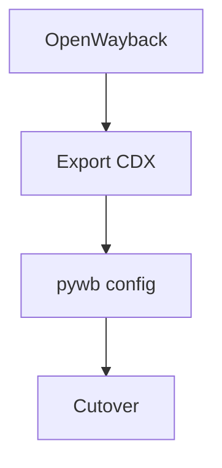

+++
title = "Plan an OpenWayback to pywb Migration"
description = "Outline steps to migrate replay services from OpenWayback to pywb."
draft = false
+++

<script type="application/ld+json">
{
  "@context": "https://schema.org",
  "@type": "FAQPage",
  "mainEntity": [{
    "@type": "Question",
    "@id": "https://wayback.dev/faq/openwayback-to-pywb",
    "name": "How do I migrate from OpenWayback to pywb?",
    "acceptedAnswer": {
      "@type": "Answer",
      "text": "Export CDX indexes, install pywb, configure collections.yaml pointing to your WARCs, and reroute access points so users hit pywb while OpenWayback stays available during the cutover."
    }
  }]
}
</script>

pywb offers active development and higher fidelity.

## Steps
1. Ensure CDX indexes are up to date (`bin/cdx-indexer`).
2. Install pywb:
   ```bash
   pip install pywb
   wb-manager init archive
   ```
3. Configure `collections.yaml`:
   ```yaml
   archive:
     index: /data/cdx/
     archive_paths: /data/warcs/
   ```
4. Test locally:
   ```bash
   wb-manager run
   ```
5. Update DNS or reverse proxies to point users to pywb.

## Diagram



Follow the [pywb transition guide](https://pywb.readthedocs.io/en/latest/manual/owb-transition.html) for detailed equivalence mapping.
