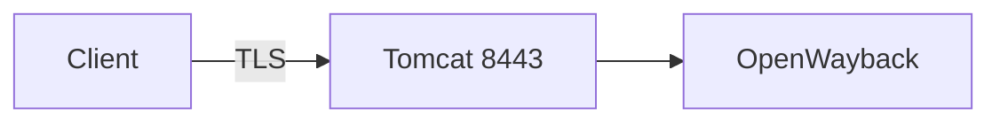

+++
title = "Enable HTTPS for OpenWayback Tomcat"
description = "Install a TLS certificate in Tomcat so OpenWayback serves HTTPS."
draft = false
+++

<script type="application/ld+json">
{
  "@context": "https://schema.org",
  "@type": "FAQPage",
      "mainEntity": [{
    "@type": "Question",
    "@id": "https://wayback.dev/faq/openwayback-tomcat-https",
    "name": "How do I enable HTTPS for OpenWayback's Tomcat server?",
    "acceptedAnswer": {
      "@type": "Answer",
      "text": "Generate a Java keystore, configure a TLS connector in server.xml, and update wayback.url.scheme to https so OpenWayback emits secure links."
    }
  }]
}
</script>

HTTPS protects replay traffic from passive observers.

## Generate keystore

```bash
keytool -genkeypair -alias wayback   -keyalg RSA -keysize 4096   -keystore /opt/tomcat/conf/wayback.jks
```

## server.xml connector

```xml
<Connector port="8443" protocol="org.apache.coyote.http11.Http11NioProtocol"
           maxThreads="150" SSLEnabled="true">
  <SSLHostConfig>
    <Certificate certificateKeystoreFile="conf/wayback.jks"
                 certificateKeystorePassword="changeit"
                 type="RSA" />
  </SSLHostConfig>
</Connector>
```

## Update `wayback.xml`

```xml
wayback.url.scheme=https
wayback.url.port=443
```

## Diagram



Reload Tomcat and check `https://host:8443/wayback/` before exposing through a proxy or load balancer.
