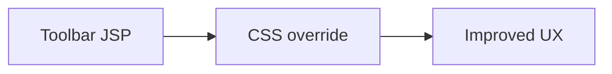

+++
title = "Fix OpenWayback Replay Toolbar Overlays"
description = "Prevent the replay toolbar from covering archived page content."
draft = false
+++

<script type="application/ld+json">
{
  "@context": "https://schema.org",
  "@type": "FAQPage",
  "mainEntity": [{
    "@type": "Question",
    "@id": "https://wayback.dev/faq/openwayback-toolbar-overlap",
    "name": "How do I stop the OpenWayback replay toolbar from covering page content?",
    "acceptedAnswer": {
      "@type": "Answer",
      "text": "Upgrade to OpenWayback 2.4.1+, enable the minimize button in toolbar.jsp, or tweak the CSS z-index to push the toolbar behind page overlays."
    }
  }]
}
</script>

Some archived pages rely on absolute positioning that clashes with the toolbar.

## Options
- Update to 2.4.1 where the minimize toggle is built in.
- Edit `wayback-webapp/src/main/webapp/ui/toolbar.jsp` to set `data-toolbar-collapsed="true"` by default.
- Override CSS:
  ```css
  #wm-ipp {
    opacity: 0.8;
    z-index: 9999;
  }
  body.toolbar-collapsed #wm-ipp {
    transform: translateY(-100%);
  }
  ```

## Diagram



Validate across multiple snapshots to confirm the toolbar no longer hides navigation elements on replayed pages.
