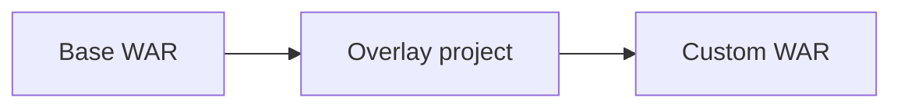

+++
title = "Build an OpenWayback WAR Overlay"
description = "Package custom configuration and UI changes using WAR overlays."
draft = false
+++

<script type="application/ld+json">
{
  "@context": "https://schema.org",
  "@type": "FAQPage",
      "mainEntity": [{
    "@type": "Question",
    "@id": "https://wayback.dev/faq/openwayback-war-overlay",
    "name": "How do I create a WAR overlay for OpenWayback customisations?",
    "acceptedAnswer": {
      "@type": "Answer",
      "text": "Create a Maven webapp that depends on openwayback-webapp as an overlay, override files like wayback.xml, and build a new WAR with mvn package for deployment."
    }
  }]
}
</script>

WAR overlays keep custom code separate from upstream OpenWayback.

## Steps
1. `mvn archetype:generate -DgroupId=org.example.wayback -DartifactId=wayback-overlay -DarchetypeArtifactId=maven-archetype-webapp`
2. Add dependencies:
   ```xml
   <dependency>
     <groupId>org.netpreserve.openwayback</groupId>
     <artifactId>openwayback-webapp</artifactId>
     <version>2.4.1</version>
     <type>war</type>
     <scope>runtime</scope>
   </dependency>
   ```
3. Configure the Maven WAR plugin with overlays.
4. Place your custom `WEB-INF/wayback.xml` or JSP files under `src/main/webapp`.
5. Build:
   ```bash
   mvn package
   ```

## Diagram



Deploy the overlay WAR to Tomcat and keep your Git repo limited to the diff you manage.
