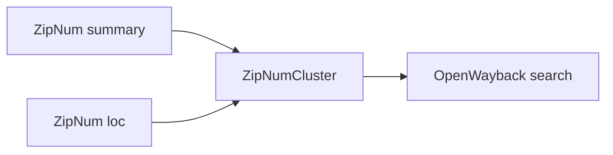

+++
title = "Tune OpenWayback ZipNum Cluster Searches"
description = "Configure ZipNumCluster so OpenWayback scales across large CDX shards."
draft = false
+++

<script type="application/ld+json">
{
  "@context": "https://schema.org",
  "@type": "FAQPage",
      "mainEntity": [{
    "@type": "Question",
    "@id": "https://wayback.dev/faq/openwayback-zipnum-cluster",
    "name": "How do I configure ZipNumCluster in OpenWayback?",
    "acceptedAnswer": {
      "@type": "Answer",
      "text": "Point ZipNumClusterSearchResultSource at the summary and loc files generated for your CDX shards so OpenWayback fetches byte ranges instead of entire indexes."
    }
  }]
}
</script>

ZipNum optimises CDX access by chunking indexes.

## Configuration

```xml
<property name="source">
  <bean class="org.archive.wayback.resourceindex.ZipNumClusterSearchResultSource">
    <property name="cluster">
      <bean class="org.archive.format.gzip.zipnum.ZipNumCluster">
        <property name="summaryFile" value="/data/cdx/summary.txt" />
        <property name="locFile" value="/data/cdx/loc.txt" />
      </bean>
    </property>
  </bean>
</property>
```

Generate summary/loc files with the Hadoop job described in the docs.

## Diagram



Monitor `catalina.out` for `ZipNum` errors after configuration to ensure the loc URLs are reachable.
